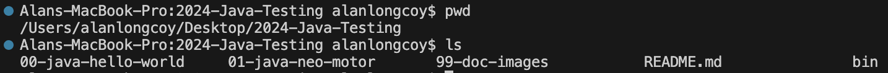
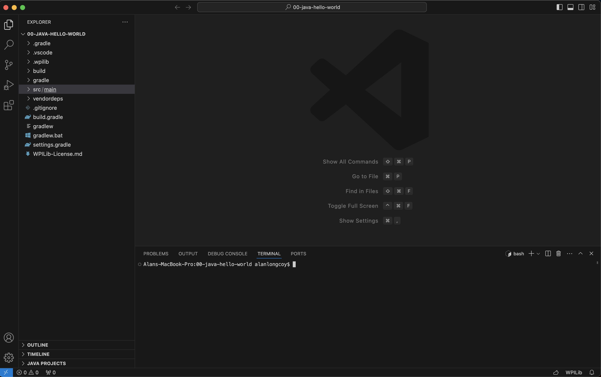
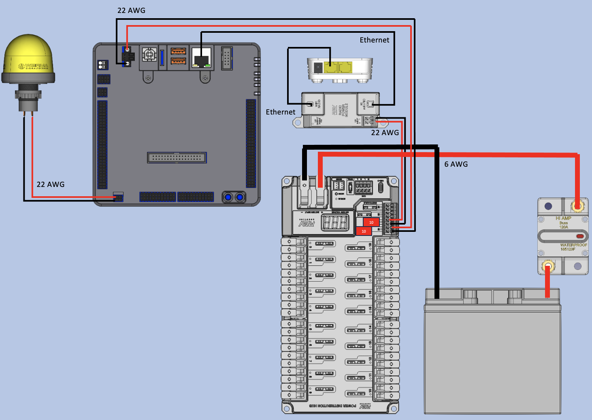
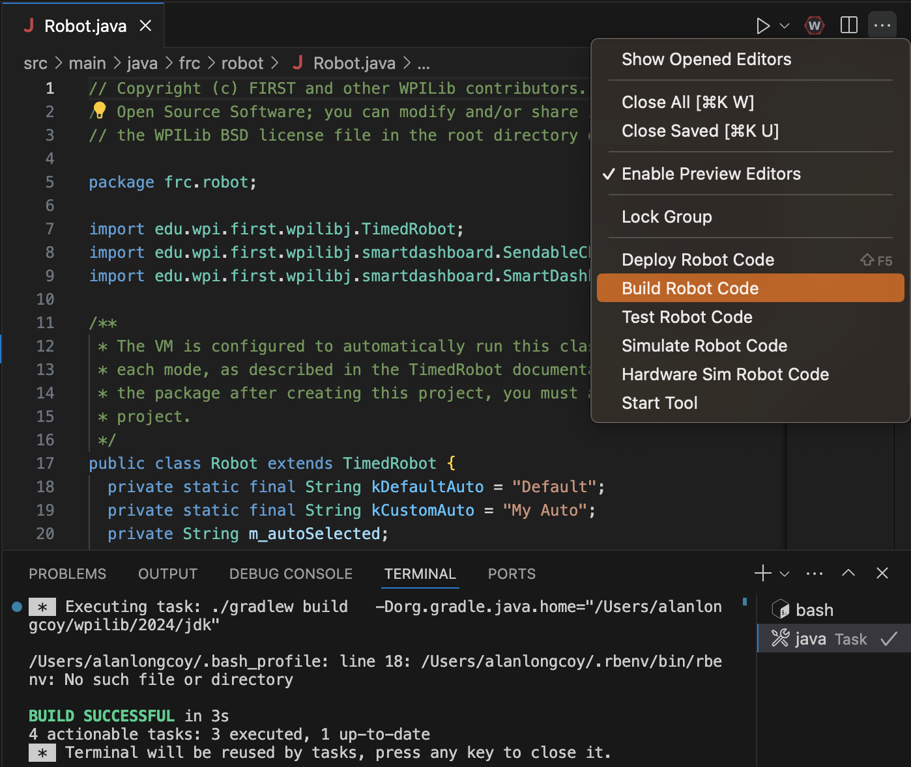
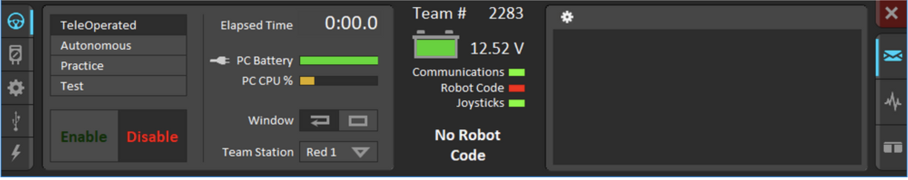
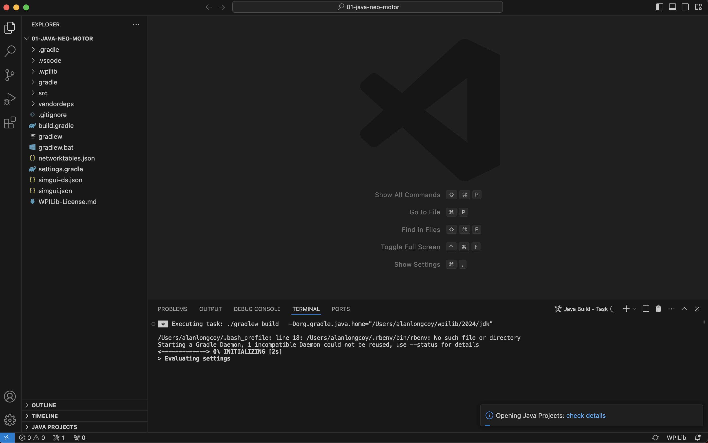
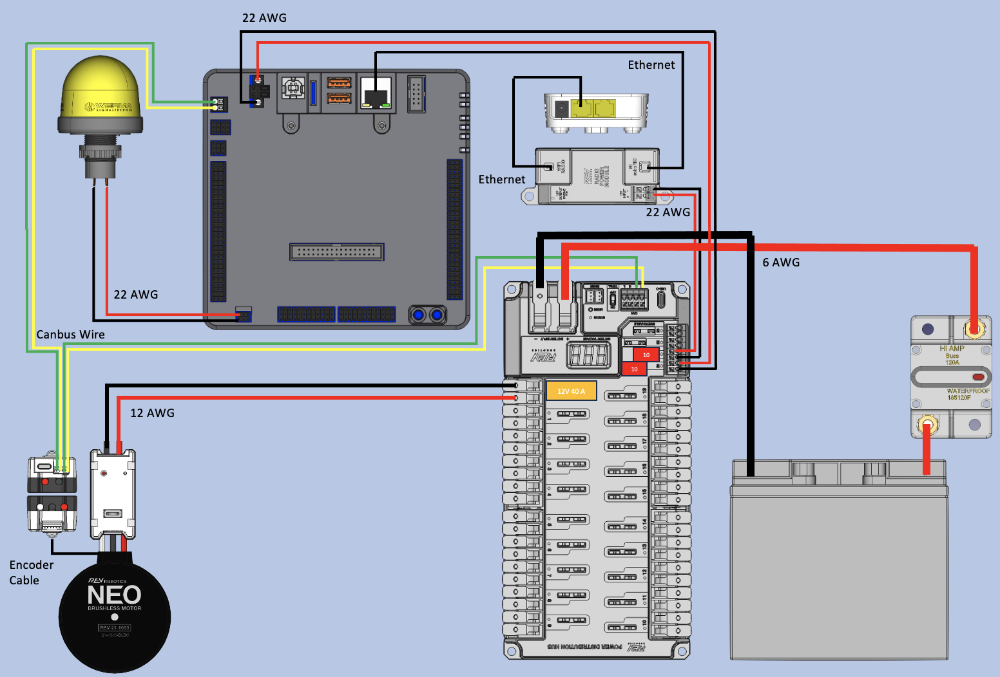
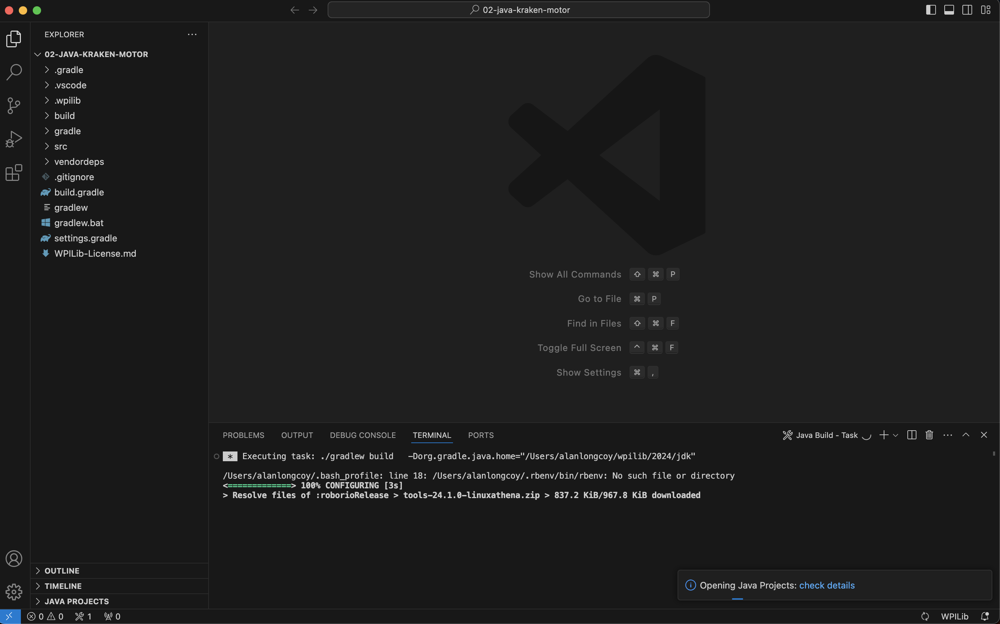
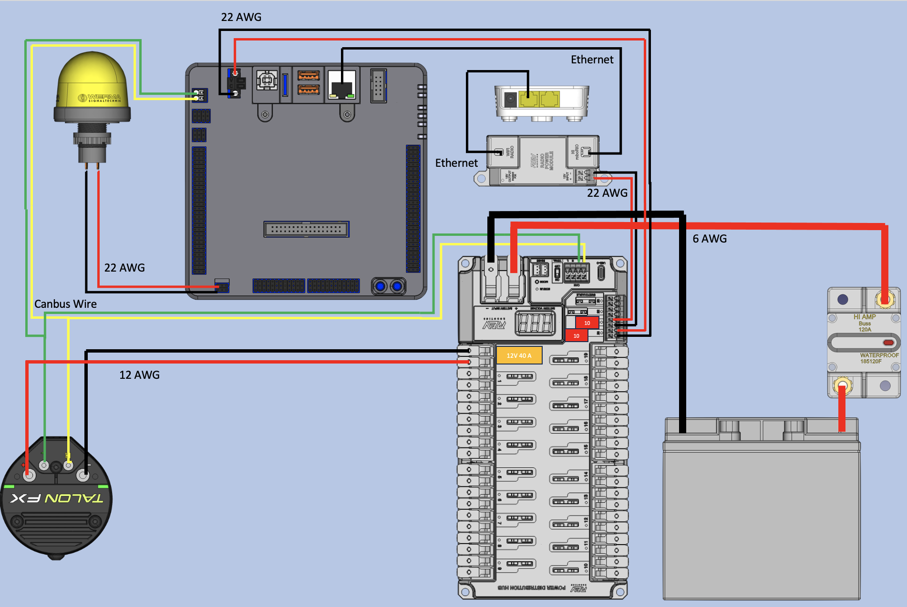

# 2024-Java-Testing
This repository contains examples we have worked through during the Summer of 2024. All examples have been tested and run on Holy Canoli and/or the 2024 competition robot for the Cresendo game.

## Contents
 - [Initial Setup](#initial-setup) 
 - [00 - Java Hello World](#00-java-hello-world)
 - [01 - Java Neo Motor](#01-java-neo-motor) 
 - [02 - Java Kraken X60 Motor](#02-java-kraken-motor) 

## Initial Setup

Below are the minimal steps to get up and running with running Java on our FRC Robots and testbeds using our example code.

### Install FRC Game Tools

To be able to control and test with the RoboRIO, we will need to have the following software installed:
  - FRC Game Tools
    - LabVIEW Update
    - FRC Driver Station
    - FRC RoboRIO Imaging Tool and Images

For detailed documentation on how to install, FIRST has great documentation [here](https://docs.wpilib.org/en/stable/docs/zero-to-robot/step-2/frc-game-tools.html).

### Installing VSCode with WPILib Command Palette

To develop Java code for our robots, we are utilizing a special version of VSCode that has been customized to make FRC Robot development easier.

For detailed documentation on how to install, FIRST has great documentation [here](https://docs.wpilib.org/en/stable/docs/zero-to-robot/step-2/wpilib-setup.html).
  - NOTE: FIRST may not have updated their docs to point to the latest version of VSCode with WPILib, to check for the latest version, you can view it on their Github release page [here](https://github.com/wpilibsuite/vscode-wpilib/releases).

### Preparing Your Robot

If you are using hardware (RoboRIO and Radio) that has already been configured, you can skip this section. Otherwise, if your RoboRIO and Radio are new, you will need to image and program them respectively.

For detailed documentation on how to this, FIRST has great documentation, below are the links to the documentation for each:
  - [Imaging RoboRIO](https://docs.wpilib.org/en/stable/docs/zero-to-robot/step-3/roborio2-imaging.html)
  - [Programming Radio](https://docs.wpilib.org/en/stable/docs/zero-to-robot/step-3/radio-programming.html)

At this point you should have all the software tools and necessary hardware equipment setup to be able to start working through these examples.

### Clone this repository

To use and work with our examples, you will need to clone this repository from Github. We use [GIT](https://www.git-scm.com) as a version control and the below commands will be for GIT.
  - NOTE: Windows users may want to install either of the software below:
    - 4265 Team uses [TortoiseGit](https://tortoisegit.org)
    - Another alternative is [Git For Windows](https://gitforwindows.org)

1. Open up a terminal session and navigate to a directory you want to clone the repository.
1. Use the following command in the terminal to clone this repository:
   ```bash
   git clone https://github.com/secret-city-wildbots/2024-Java-Testing.git
   ```
1. Now you should have a copy of the code locally you can test and learn with. You should have a directory called `2024-Java-Testing` and when going into that directory you should see some examples like: `00-*`, `01-*`, etc.

   

## 00-java-hello-world

### Description

The goal of the example is to do the following:

1. Be able to connect and deploy to the RoboRIO
1. Be able to enable the robot
1. Print a statement repeatedly in the teleop periodic function

Note: This example is a `Timed Robot` code layout.

### Setup VSCode

To be able to use VSCode with this example, you will need to make sure you open VSCode to the specific folder, below are the steps:

  1. launch the VSCode application
  1. Go to `File` -> `New Window`
  1. While your new window is in focus, Go to `File` -> `Open Folder...`
  1. Select the directory `00-java-hello-world`
  1. Now you should be able to code and utilize all of the features built into the WPILib version of VSCode. Your VSCode should look like something below:
     

### Hardware Setup

Below is an image showing the minimum hardware needed to run and work with this example along with the wiring connections:



### Code Overview

As mentioned in the description, we will be deploying the code to the RoboRIO, enabling the RoboRIO, switching to teleop mode, and observing the `Hello World!` statement being printed out in the console.

The main code lives in the `src/main/java/frc/robot` directory. There are 2 files:
  - Main.java
     - entry point for the program
  - Robot.java
    - This contains all of the init and periodic functions for the robot
       - robot
       - autonomous
       - teleop
       - disabled
       - test
       - simulation

you will notice on lines 79 - 83 in `Robot.java` the following code:

```java
/** This function is called periodically during operator control. */
  @Override
  public void teleopPeriodic() {
    System.out.println("Hello world!\n");
  }
```

The `periodic` function(s), will typically be called approx. every 20ms. Within that function we print out `Hello World!`.

### Running Example

1. After connecting everything as indicated in the diagram, power on the system
1. Connect to the Radio's wifi network
1. In VSCode, you will hit the `...` on the top right and click `Build Robot Code`. You should see `BUILD SUCCESSFUL` in the terminal of VSCode
   
1. In VSCode, you will hit the `...` on the top right again and click `Deploy Robot Code`
1. Now open up the FRC Driver Station
1. Make sure `TeleOperated` is selected and then click the `Enable` button
   
1. You should see the RSL (robot signal light) start to blink and the console start to fill up with `Hello World!`

## 01-java-neo-motor

### Description

The goal of the example is to do the following:

1. Be able to connect and deploy to the RoboRIO
1. Be able to enable the robot
1. Control a neo motor with a Xbox Controller

Note: This example is a `Timed Robot` code layout.

### Setup VSCode

To be able to use VSCode with this example, you will need to make sure you open VSCode to the specific folder, below are the steps:

  1. launch the VSCode application
  1. Go to `File` -> `New Window`
  1. While your new window is in focus, Go to `File` -> `Open Folder...`
  1. Select the directory `01-java-neo-motor`
  1. Now you should be able to code and utilize all of the features built into the WPILib version of VSCode. Your VSCode should look like something below:
     

### Hardware Setup

Below is an image showing the minimum hardware needed to run and work with this example along with the wiring connections:


### Code Overview

As mentioned in the description, we will be deploying the code to the RoboRIO, enabling the RoboRIO, switching to teleop mode, and be able to control the neo motor with the Xbox Controller.

The main code lives in the `src/main/java/frc/robot` directory. There are 2 files:
  - Main.java
     - entry point for the program
  - Robot.java
    - This contains the following functions for the robot
       - robotInit
       - teleopPeriodic

you will notice on lines 14 - 17 in `Robot.java` the following import statements:

```java
  import com.revrobotics.RelativeEncoder;
  import com.revrobotics.SparkPIDController;
  import com.revrobotics.CANSparkMax;
  import com.revrobotics.CANSparkLowLevel.MotorType;
```

Here we are needing to import some 3rd party libraries. There are some good FIRST Docs describing how to import and manage 3rd party libraries [here](https://docs.wpilib.org/en/stable/docs/software/vscode-overview/3rd-party-libraries.html#rd-party-libraries). Towards the bottom of that page, there is a section called [Vendor Libraries](https://docs.wpilib.org/en/stable/docs/software/vscode-overview/3rd-party-libraries.html#vendor-libraries). There they will have a list of the URLs for the most popular libraries used. Also you should be able find the import instructions on the vendors websites as well.

At the top of the `Robot` class, we instantiate the following variables utilizing the imported libraries (lines 24 - 29):

```java
  private Joystick m_stick;  // this will be used to connect to the xbox controller
  private static final int deviceID = 2; // We need to get the Canbus ID for the Spark Max Controller
  private CANSparkMax m_motor; // Define the controller for the motor
  private SparkPIDController m_pidController; // Define the PID Controller for the motor
  private RelativeEncoder m_encoder; // Define the encoder for the motor
  public double kP, kI, kD, kIz, kFF, kMaxOutput, kMinOutput, maxRPM; // Define the variables needed for the PID
```

In the robotInit function we start to initialize the variables and set their default values (lines 33 - 72).

```java
    // initialize controller / joystick
    m_stick = new Joystick(0);

    // initialize motor
    m_motor = new CANSparkMax(deviceID, MotorType.kBrushless);

    /**
     * The RestoreFactoryDefaults method can be used to reset the configuration parameters
     * in the SPARK MAX to their factory default state. If no argument is passed, these
     * parameters will not persist between power cycles
     */
    m_motor.restoreFactoryDefaults();

    /**
     * In order to use PID functionality for a controller, a SparkPIDController object
     * is constructed by calling the getPIDController() method on an existing
     * CANSparkMax object
     */
    m_pidController = m_motor.getPIDController();

    // Encoder object created to display position values
    m_encoder = m_motor.getEncoder();

    // PID coefficients
    kP = 6e-5; 
    kI = 0;
    kD = 0; 
    kIz = 0; 
    kFF = 0.000015; 
    kMaxOutput = 1; 
    kMinOutput = -1;
    maxRPM = 5700;

    // set PID coefficients
    m_pidController.setP(kP);
    m_pidController.setI(kI);
    m_pidController.setD(kD);
    m_pidController.setIZone(kIz);
    m_pidController.setFF(kFF);
    m_pidController.setOutputRange(kMinOutput, kMaxOutput);
```

Right below that you will see an example of how we can send the PID values to a dashboard (lines 74 - 81). Note this uses the SmartDashboard as it was provided in the vendor example, we will still most likely use our LabVIEW dashboard this upcoming season.

```java
    // display PID coefficients on SmartDashboard
    SmartDashboard.putNumber("P Gain", kP);
    SmartDashboard.putNumber("I Gain", kI);
    SmartDashboard.putNumber("D Gain", kD);
    SmartDashboard.putNumber("I Zone", kIz);
    SmartDashboard.putNumber("Feed Forward", kFF);
    SmartDashboard.putNumber("Max Output", kMaxOutput);
    SmartDashboard.putNumber("Min Output", kMinOutput);
```

Now in the `teleopPeriodic` function we will see the use of the setup that occured in the `robotInit` function. First we are reading in the PID Values from the SmartDashboard and updating the PID controller with the new values (lines 86 - 104).

```java
    // read PID coefficients from SmartDashboard
    double p = SmartDashboard.getNumber("P Gain", 0);
    double i = SmartDashboard.getNumber("I Gain", 0);
    double d = SmartDashboard.getNumber("D Gain", 0);
    double iz = SmartDashboard.getNumber("I Zone", 0);
    double ff = SmartDashboard.getNumber("Feed Forward", 0);
    double max = SmartDashboard.getNumber("Max Output", 0);
    double min = SmartDashboard.getNumber("Min Output", 0);

    // if PID coefficients on SmartDashboard have changed, write new values to controller
    if((p != kP)) { m_pidController.setP(p); kP = p; }
    if((i != kI)) { m_pidController.setI(i); kI = i; }
    if((d != kD)) { m_pidController.setD(d); kD = d; }
    if((iz != kIz)) { m_pidController.setIZone(iz); kIz = iz; }
    if((ff != kFF)) { m_pidController.setFF(ff); kFF = ff; }
    if((max != kMaxOutput) || (min != kMinOutput)) { 
      m_pidController.setOutputRange(min, max); 
      kMinOutput = min; kMaxOutput = max; 
    }
```

Below that setup is where the magic happens for controlling the motor with the xbox controller (lines 106 - 122). We get the Y axis value of the left joystick on the xbox controller (this will be a value ranging from -1 to +1) and multiply that by the maxRPM of the neo motor. That will give us the setpoint for the PID to command the motor follow.

```java
    /**
     * PIDController objects are commanded to a set point using the 
     * SetReference() method.
     * 
     * The first parameter is the value of the set point, whose units vary
     * depending on the control type set in the second parameter.
     * 
     * The second parameter is the control type can be set to one of four 
     * parameters:
     *  com.revrobotics.CANSparkMax.ControlType.kDutyCycle
     *  com.revrobotics.CANSparkMax.ControlType.kPosition
     *  com.revrobotics.CANSparkMax.ControlType.kVelocity
     *  com.revrobotics.CANSparkMax.ControlType.kVoltage
     */
    double setPoint = m_stick.getY()*maxRPM;
    System.out.println(m_stick.getY());
    m_pidController.setReference(setPoint, CANSparkMax.ControlType.kVelocity);
```

### Running Example

1. After connecting everything as indicated in the diagram, power on the system
1. Connect to the Radio's wifi network
1. In VSCode, you will hit the `...` on the top right and click `Build Robot Code`. You should see `BUILD SUCCESSFUL` in the terminal of VSCode
   
1. In VSCode, you will hit the `...` on the top right again and click `Deploy Robot Code`
1. Now open up the FRC Driver Station
1. Make sure `TeleOperated` is selected and then click the `Enable` button
   
1. You should see the RSL (robot signal light) start to blink and now you should be able to control the neo motor with the left joystick on the xbox controller.

## 02-java-kraken-motor

### Description

The goal of the example is to do the following:

1. Be able to connect and deploy to the RoboRIO
1. Be able to enable the robot
1. Control a kraken x60 motor with a Xbox Controller

Note: This example is a `Timed Robot` code layout.

### Setup VSCode

To be able to use VSCode with this example, you will need to make sure you open VSCode to the specific folder, below are the steps:

  1. launch the VSCode application
  1. Go to `File` -> `New Window`
  1. While your new window is in focus, Go to `File` -> `Open Folder...`
  1. Select the directory `02-java-kraken-motor`
  1. Now you should be able to code and utilize all of the features built into the WPILib version of VSCode. Your VSCode should look like something below:
     

### Hardware Setup

Below is an image showing the minimum hardware needed to run and work with this example along with the wiring connections:


### Code Overview

As mentioned in the description, we will be deploying the code to the RoboRIO, enabling the RoboRIO, switching to teleop mode, and be able to control the neo motor with the Xbox Controller.

The main code lives in the `src/main/java/frc/robot` directory. There are 2 files:
  - Main.java
     - entry point for the program
  - Robot.java
    - This contains all of the init and periodic functions for the robot
       - robot
       - autonomous
       - teleop
       - disabled
       - test
       - simulation

you will notice on lines 7 - 10 in `Robot.java` the following import statements:

```java
  import com.ctre.phoenix6.configs.TalonFXConfiguration;
  import com.ctre.phoenix6.controls.DutyCycleOut;
  import com.ctre.phoenix6.hardware.TalonFX;
  import com.ctre.phoenix6.signals.InvertedValue;
```

Here we are needing to import some 3rd party libraries. There are some good FIRST Docs describing how to import and manage 3rd party libraries [here](https://docs.wpilib.org/en/stable/docs/software/vscode-overview/3rd-party-libraries.html#rd-party-libraries). Towards the bottom of that page, there is a section called [Vendor Libraries](https://docs.wpilib.org/en/stable/docs/software/vscode-overview/3rd-party-libraries.html#vendor-libraries). There they will have a list of the URLs for the most popular libraries used. Also you should be able find the import instructions on the vendors websites as well.

At the top of the `Robot` class, we instantiate the following variables utilizing the imported libraries (lines 22 - 25):

```java
  private static final String CANBUS_NAME = "rio"; // Canbus name
  private final TalonFX kraken = new TalonFX(43, CANBUS_NAME); // Motor
  private final DutyCycleOut krakenOut = new DutyCycleOut(0); // Motor Output
  private Joystick m_stick; // Xbox Controller
```

In the robotInit function we start to initialize the variables and set their default values (lines 33 - 41).

```java
    /* Configure the devices */
    var krakenConfiguration = new TalonFXConfiguration();

    m_stick = new Joystick(0);

    /* User can optionally change the configs or leave it alone to perform a factory default */
    krakenConfiguration.MotorOutput.Inverted = InvertedValue.CounterClockwise_Positive;
    kraken.getConfigurator().apply(krakenConfiguration);
    kraken.setSafetyEnabled(true);
```

Now in the `teleopPeriodic` function we will see the use of the setup that occured in the `robotInit` function(lines 58 - 59). We get the X axis value of the left joystick on the xbox controller (this will be a value ranging from -1 to +1) and set that to the control output of the Kraken motor. 

```java
    // Get controller joystick value and set it to the motor output
    krakenOut.Output = m_stick.getX();
    kraken.setControl(krakenOut);
```

Now in the `disabledPeriodic` function we will make sure the robot is set to a 0 output value (lines 67 - 69)

```java
    /* Zero out controls so we aren't just relying on the enable frame */
    krakenOut.Output = 0;
    kraken.setControl(krakenOut);
```

### Running Example

1. After connecting everything as indicated in the diagram, power on the system
1. Connect to the Radio's wifi network
1. In VSCode, you will hit the `...` on the top right and click `Build Robot Code`. You should see `BUILD SUCCESSFUL` in the terminal of VSCode
   
1. In VSCode, you will hit the `...` on the top right again and click `Deploy Robot Code`
1. Now open up the FRC Driver Station
1. Make sure `TeleOperated` is selected and then click the `Enable` button
   
1. You should see the RSL (robot signal light) start to blink and now you should be able to control the kraken x60 motor with the left joystick on the xbox controller.
